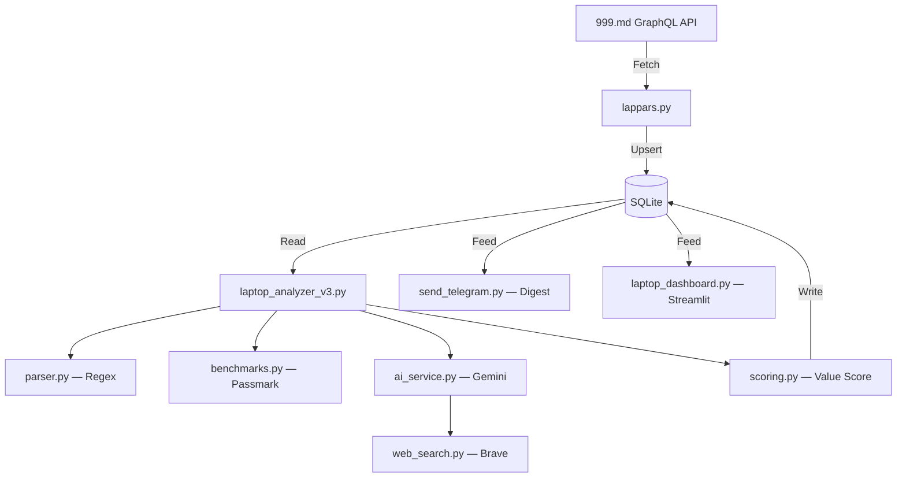

# 💻 NotebookBuy

[](https://www.python.org/downloads/)
[](LICENSE)
[](https://github.com/zabrodschiipavel-sketch/notebookbuy/actions/workflows/ci.yml)

**Find the best laptop deals on [999.md](https://999.md)** — scrape listings via GraphQL, score the hardware against Passmark benchmarks, and get a ranked shortlist in Telegram every morning.

A GitHub Actions cron runs the whole pipeline daily and sends the result to a Telegram chat. The Streamlit dashboard is there for digging into the accumulated data afterwards.

> **Disclaimer:** NotebookBuy is not affiliated with 999.md. Use respectful request rates and comply with the site's terms of service. Scraping is for personal research only.

---

## ✨ Features

| Feature | Description |
|---------|-------------|
| **GraphQL Scraper** | Direct API queries — no HTML parsing overhead |
| **Hardware Scoring** | Passmark CPU + GPU fuzzy-match benchmarks |
| **AI Spec Extraction** | Gemini fallback when regex can't parse the ad |
| **Real World Prices** | Brave Search finds retail and review pages; the model reads the figures out of them |
| **Scam Screening** | Heuristics plus a Gemini pass over the shortlist drop parsing garbage and locked/stolen units |
| **Honest Labelling** | Anything computed rather than found is marked `≈` and named an estimate |
| **Telegram Digest** | Daily shortlist with price-drop alerts; repeats are held back |
| **Price Tracking** | Every price change is recorded; history visualized per ad |
| **Dynamic FX Rates** | USD/EUR → MDL rates auto-fetched & cached for 24 h |
| **Dashboard** | Streamlit UI with scatter plots, filters, and CSV/JSON export |

---

## 🏗️ Architecture



Regex parses what it can; only ads it fails on go to Gemini. Passmark supplies the raw
performance numbers. World prices and Notebookcheck ratings are looked up through Brave
and read out of the returned snippets — when a lookup finds nothing, a component-based
formula fills in and **the digest marks that value as an estimate** rather than passing
it off as market data.

## 📂 Project Structure

```
notebookbuy/
├── lappars.py              # 999.md GraphQL scraper + price tracker
├── laptop_analyzer_v3.py   # Spec extraction + benchmark scoring pipeline
├── send_telegram.py        # Digest: ranking, repeat suppression, price drops
├── laptop_dashboard.py     # Streamlit analytics dashboard
├── parser.py               # Precompiled regex for CPU/GPU/RAM/SSD
├── benchmarks.py           # Passmark data fetch, cache, and fuzzy search
├── scoring.py              # Value-score formula, classification, SSD heuristic
├── estimation.py           # Shared component-based fallback price/score
├── ai_service.py           # Gemini extraction, deal review, per-model rate limits
├── web_search.py           # Brave Search client for price/review lookups
├── currency.py             # Dynamic exchange rate fetching
├── db.py                   # SQLite schema, migrations, context manager
├── app_config.py           # Env-based runtime configuration
├── retry_utils.py          # Rate limiter + retry that honours server back-off
├── launcher.py             # PyInstaller .exe entry point
├── query_999.graphql       # GraphQL query for 999.md ads
├── pyproject.toml          # Project metadata, dependencies, ruff, pytest
├── .env.example            # Template for environment variables
├── tests/                  # 145 tests — see `pytest -v`
│   ├── test_parser.py          # Regex extraction
│   ├── test_scoring.py         # Scoring, classification & SSD heuristic
│   ├── test_estimation.py      # Fallback price/score estimation
│   ├── test_benchmarks.py      # Passmark fuzzy-match lookup
│   ├── test_lappars.py         # Price-tracking upsert & GraphQL parse
│   ├── test_send_telegram.py   # Digest selection, novelty, drops, formatting
│   ├── test_ai_service.py      # Deal review, rate limiting, Brave lookups
│   ├── test_web_search.py      # Brave client (fake transport, no network)
│   ├── test_retry_utils.py     # Rate limiter & back-off
│   ├── test_analyzer_cache.py  # External-lookup cache markers
│   ├── test_currency.py        # Exchange rate fallback
│   └── test_db.py              # Schema creation & migration
└── .github/
    ├── dependabot.yml      # Monthly pip + actions updates
    └── workflows/
        ├── ci.yml          # Lint + test on push/PR and weekly
        └── daily_scrape.yml # Scrape → analyze → Telegram, daily at 06:00 UTC
```

---

## ⚡ Quick Start

### 1. Install

```bash
git clone https://github.com/zabrodschiipavel-sketch/notebookbuy.git
cd notebookbuy
python -m venv .venv
```

Activate the virtual environment:

- **Windows:** `.venv\Scripts\activate`
- **macOS / Linux:** `source .venv/bin/activate`

Then install dependencies:

```bash
pip install -e ".[dev]"
```

### 2. Configure

```bash
cp .env.example .env   # Windows: copy .env.example .env
```

Every key is **optional** — with none of them the pipeline still scrapes, parses with
regex and scores against Passmark (Passmark data downloads on the first analyzer run).
Each key buys back a specific capability:

| Variable | What it enables | Without it |
|----------|-----------------|------------|
| `GEMINI_API_KEY` | Spec extraction for ads regex can't parse; scam review of the shortlist | Those ads drop out of the ranking; no AI review |
| `BRAVE_API_KEY` | Real world prices and Notebookcheck ratings | Both come from the component formula, marked `≈` |
| `TELEGRAM_BOT_TOKEN` + `TELEGRAM_CHAT_ID` | Sending the digest | `send_telegram.py` exits with a config error |

Free-tier limits worth knowing: Gemini allows **15 requests per minute per model** — the
client throttles to `GEMINI_RPM_LIMIT` (12) rather than firing until it gets 429s. Brave
allows **1 req/s and 2000/month**, far more than a daily run needs. See `.env.example`
for the full list of tunables.

### 3. Run

```bash
# Fetch latest ads (--region all covers Moldova; default is balti)
python lappars.py --once --region all

# Analyze & score
python laptop_analyzer_v3.py

# Send the digest to Telegram
python send_telegram.py

# Launch dashboard
streamlit run laptop_dashboard.py
```

---

## 📬 The Daily Digest

`.github/workflows/daily_scrape.yml` runs the pipeline at 06:00 UTC and posts a
shortlist to Telegram. The database and lookup caches persist between runs through the
Actions cache.

What the digest does beyond ranking by score:

- **Marks estimates.** A figure found by search reads `-21% vs мировая цена` and
  `NBC Score: 88%`. A figure computed by the component formula reads `≈-19% vs расчёт`
  and `Класс: ≈78%`, with a footnote explaining the sign. An estimate is never dressed
  up as market data.
- **Holds back repeats.** A listing already sent at an unchanged price waits
  `DIGEST_REPEAT_COOLDOWN_DAYS` (7) before it can return; any price move makes it
  eligible again immediately, and never-seen listings rank ahead of repeats. If that
  leaves too few entries, held-back ones come back — the digest never ends up shorter
  than it would have been.
- **Reports price drops.** A separate block lists laptops that got cheaper, filtered
  against sellers correcting a typo (a "-99% drop") and spare-parts ads.
- **Screens for scams.** Heuristics flag suspiciously cheap Apple Silicon (MDM/iCloud
  locks); a Gemini pass over the shortlist drops listings whose specs contradict the
  title and warns about the rest.

---

## 🧮 How Scoring Works

Each laptop gets a **Value Score** = performance-per-MDL index.

```
tech_pts = (CPU_bench × 0.55 + GPU_bench × 0.35 + (RAM×150 + SSD_bonus) × 0.10)
         × RAM_multiplier × age_penalty × broken_penalty

value_score = tech_pts / price × 100
```

- **CPU / GPU benchmarks** — looked up from [Passmark](https://www.cpubenchmark.net/) via fuzzy name matching.
- **RAM multiplier** — 1.0 at 16 GB, scaling from 0.6 (4 GB) to 1.18 (48 GB); 0.05 when RAM is unknown.
- **SSD bonus** — 2 points per GB, capped at 4000. A missing size falls back to a size plausible for the model year.
- **Age penalty** — 12 % per year from current; floors at 0.05.
- **Broken penalty** — ×0.05 if the ad is marked as spare parts.
- **Low-end guards** — below `MIN_ACCEPTABLE_TECH_PTS` the score is squashed quadratically, and a CPU under `MIN_CPU_SCORE` halves it. Both exist to stop a cheap weak machine from topping a per-MDL ranking.
- Higher **value_score** → better deal. The digest only sends listings scoring 100 or more.

---

## 🧪 Testing & Linting

```bash
pytest -v
```

```bash
ruff check .
```

No test touches the network: the Brave client, the Gemini calls and the Telegram send
are all exercised through fakes. Configuration for both tools lives in `pyproject.toml`.
CI runs them on Python 3.10, 3.12 and 3.14 for every push and pull request, plus weekly
— dependencies are unpinned and the daily job installs them fresh each morning, so drift
gets caught without waiting for the next commit.

---

## 📦 Building an .exe

```bash
pyinstaller laptop_finder.spec
```

The standalone executable will be in `dist/`.

---

## 🤝 Contributing

See [CONTRIBUTING.md](CONTRIBUTING.md) for development setup, code style, and PR guidelines.

---

## 📄 License

[MIT](LICENSE)
